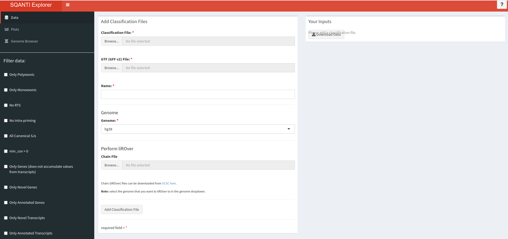

# What is SQANTI Explorer?
SQANTI Explorer provides several data exploration utlities to allow you to explore the isoform classifications provided by SQANTI ([SQANTI paper](https://genome.cshlp.org/content/28/7/1096)). SQANTI Explorer provides live filtering of isoforms, multiple graphs, and an integrated genome browser with [IGV](http://igv.org/). Furthermore, SQANTI Explorer allows for inter-sample analysis with multi-sample graphs and multi-track genome browsing. If you wish to perform inter-species analysis, SQANTI Explorer provides built-in liftOver support with [UCSC liftOver](https://genome.ucsc.edu/cgi-bin/hgLiftOver).

# Installation
If you are viewing this from SQANTI Explorer already, you can skip this section.

SQANTI Explorer is a [Shiny](https://shiny.rstudio.com/) app and is distributed as a [Docker](https://www.docker.com/) image.

1. Ensure you have [Docker](https://www.docker.com/) installed. [Install here](https://www.docker.com/get-started)
2. Download the [Docker image](https://hub.docker.com/r/jcbwndsr/sqantiexplorer) with `docker pull jcbwndsr/sqantiexplorer` (you may need to run with sudo)
3. Run the docker image with `docker run -it -p 3838:80 jcbwndsr/sqantiexplorer`
4. Navigate to [localhost:3838](http://localhost:3838) to see SQANTI Explorer

# Uploading your data
- Upload your data from the "Data" tab
- Select the SQANTI classification file and its corresponding GTF file
- Give the dataset a unique name
- Select the genome required from the dropdown
- If you wish to perform a liftOver (for inter-species analysis) then upload a chain file.
  - You can download chain files from the [UCSC server](http://hgdownload.soe.ucsc.edu/downloads.html)
  - Note that you must select the **target**^ genome from the genome dropdown that you want to **liftOver to**.
- Click "Add Classification File" and after a short wait time your dataset will appear in the table on the right
- Repeat this for as many datasets as you wish to analyze.

# Filtering
The filters panel in the sidebar allows you to filter your datasets by certain criteria. By ticking each checkbox, the isoforms in each of your datasets will be dynamically filtered.

# Plots
The plots tab provides many graphs to explore your filtered data. All graphs except the summary graph will be updated each time you select filters from the filters panel; the summary graph displays a summary of the *unfiltered* datasets. Clicking on the different regions of the graphs will update the count in the "Selected Transcripts" box. You can download your data with the download buttons:

- **Download Filtered Classification** will download a SQANTI classification CSV file of all the filtered datasets.
- **Download Filtered GTF** will download a ZIP file containing the GTFs for each filtered datasets.
- **Download Selected Classification** will download a SQANTI classification CSV file of the selected transcripts.
- **Download Selected GTF** will download a GTF containing the selected transcripts.

# Genome Browser
The genome browser tab allows you to explore the transcripts in your filtered datasets with [IGV](http://igv.org/). You can view datasets with the same genome side-by-side. Below are instructions for using the genome browser.

1. Select your primary dataset with the dropdown in "Choose datasets to browse" and click "Select dataset"
2. Your dataset will appear in the "Selected Datasets" table
3. If you have uploaded multiple datasets with the **same** genome, a second dropdown will appear allowing you to add those datasets to the selected datasets.
4. Once you have selected the required datasets, click the "load selected datasets" button to load the genome browser. You can clear the datasets with the "clear" button to start again and repeat steps 1-4.
5. The transcripts will be filtered by the filters selected in the filters panel. If you need to change the selected filters, you must click "Update Genome Browser" to see the changes in the genome browser.
6. Scroll through the genome browser to visualize your transcripts and follow the "Navigate" section of the [IGV Help Guide](https://igvteam.github.io/igv-webapp/) for more guidance.

# Bugs and Feature Requests
If you find a bug that you would like fixed or have a feature request, please submit an issue at the [issue tracker](https://github.com/jacobwindsor/SQANTIExplorer/issues).

# Support
This project has been developed as part of the minor project for the [BIST](http://bist.eu) MMRES.

Thanks to Julien Lagarde (CRG), David Alejandro Juan Sopeña (UPF), and Luis Jose Ferrandez Peral (UPF) for their mentorship.
